

  

    <a href="README_ZH.md">
      
      中文
    </a>

  
  
  
  
  

# Pomodoro Logger Enhanced :clock930:

> **Invest your time easily**

A **desktop time tracker** based on the [Pomodoro Technique](https://en.wikipedia.org/wiki/Pomodoro_Technique) that helps you master your work and study time through a five-step workflow:
**Plan** tasks → **Track** focus → **Record** desktop activity → **Process** locally → **Visualize** and review.

This repository is an enhanced edition of the [original Pomodoro Logger](https://github.com/zxch3n/PomodoroLogger), with optimizations in card editing, history view review, memory usage, and CPU usage.

## ✨ The Five-Step Workflow

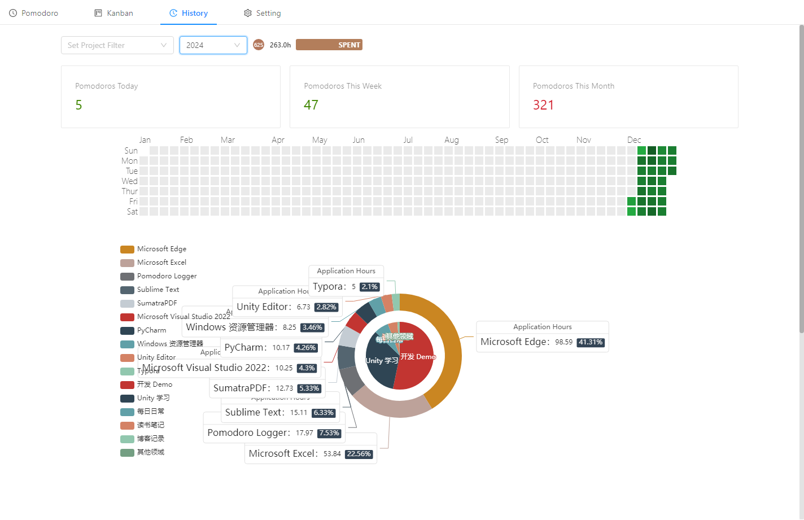

1. 🗺️ **Plan** —— organize and estimate tasks with Kanban
   - Board lists (`Backlog` / `Todo` / `In Progress` / `Done`)
   - Card dragging, estimated vs actual time spent
2. ⏱️ **Track** —— focus with the Pomodoro technique
   - Task time tracking, pomodoro counts
   - Focus / rest reminders
3. 📝 **Record** —— automatic desktop activity tracking
   - Automatically records the names and titles of the apps you use
4. 🔧 **Process** —— local processing & efficiency
   - Link tasks to focus sessions
   - Distracting-app detection and a heuristic efficiency score
   - Import / export / delete; everything stays **local**
5. 📊 **Visualize** —— review where your time goes
   - Efficiency dots
   - Calendar heat maps, pie charts, word clouds

## ① 🗺️ Plan: Kanban Task Management

The built-in [Kanban Board](https://en.wikipedia.org/wiki/Kanban_board) works together with the Pomodoro timer: while you focus on a board, your sessions are automatically linked to the cards in the `In Progress` list, and the app records the **estimated time vs actual time** of every card.

Lists are divided into `Backlog` (backlog), `Todo` (today's to-dos), `In Progress`, and `Done`. You can customize the lists, but please keep the `In Progress` and `Done` lists so that time can be tracked, estimated, and analyzed.

> 💡 Tip: leave as few cards in `In Progress` as possible for more accurate statistics.

| **Kanban Board**                                         | **Dragging Cards**                                        |
| :------------------------------------------------------- | :-------------------------------------------------------- |
| 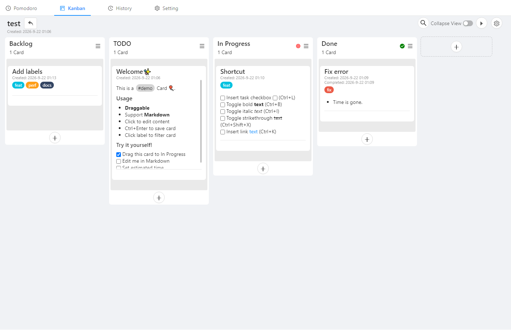 | 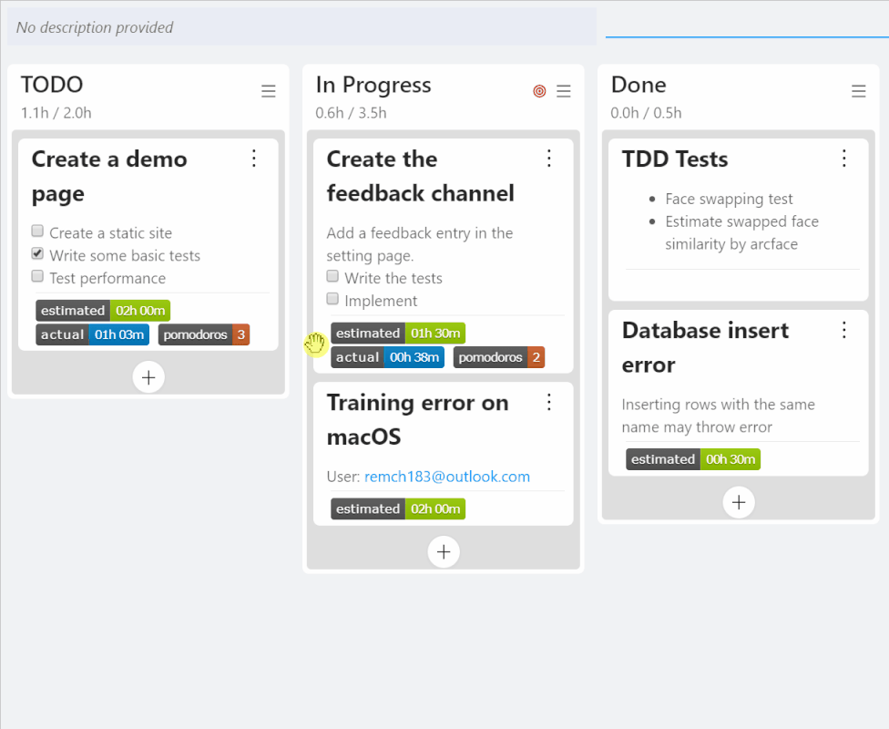 |
| **Estimating Time Spent**                                | **Searching Cards**                                       |
| 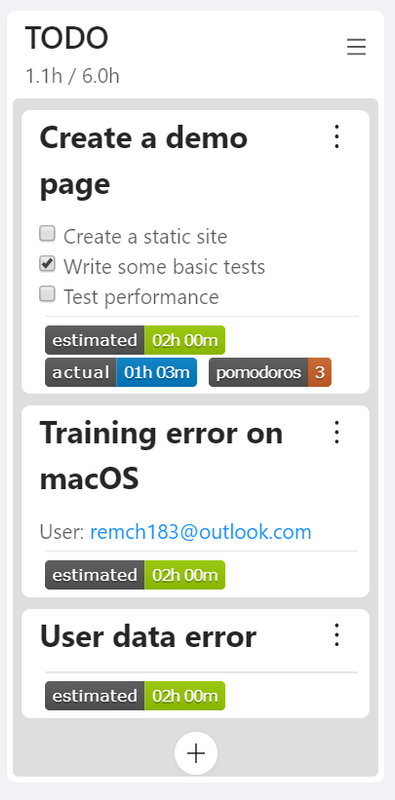         | 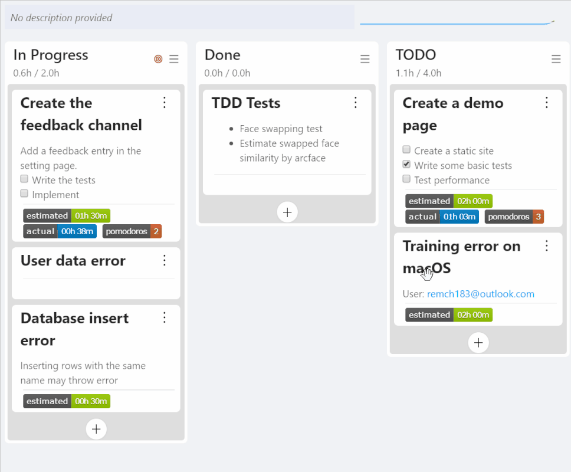   |

<b>🗂️ Kanban Enhancements</b> —— rich-text cards · colored labels · creation/completion time

 

- **Card editor**: quick actions for task boxes (`[ ]`), **bold**, *italic*, ~~strikethrough~~, and links.
- **Colored labels**: supports colored labels with label suggestions and search, plus **click-to-filter**.
- **Task creation/completion time**: display creation/completion time for kanban and card.

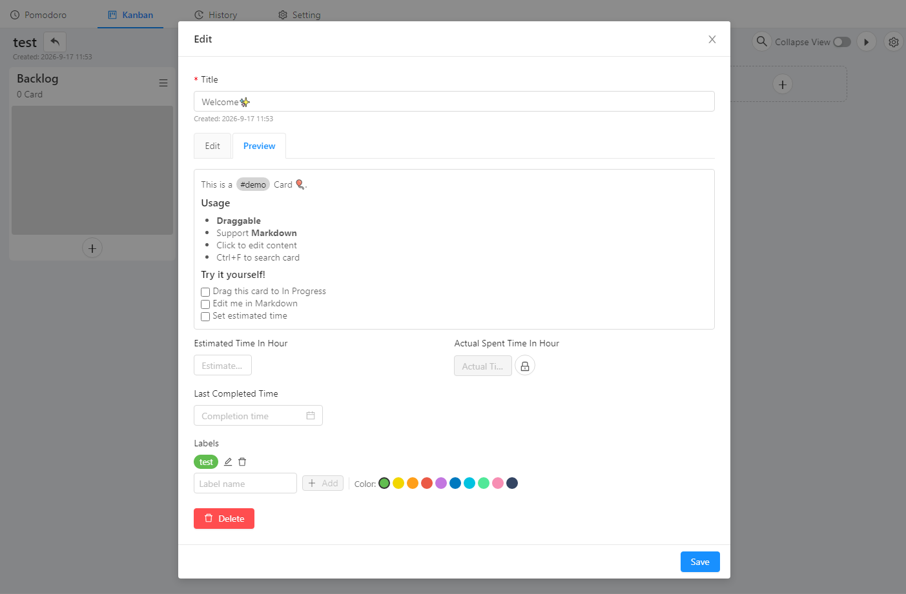

## ② ⏱️ Track: Pomodoro Technique

A work cycle = **25 minutes of focus + 5 minutes of rest**. The app tracks task time and automatically keeps a running count of your pomodoros, with automatic reminders at the end of every stage.

| **Choosing a Focus Task**                                    | **Countdown in System Tray**                            |
| :----------------------------------------------------------- | :------------------------------------------------------ |
| 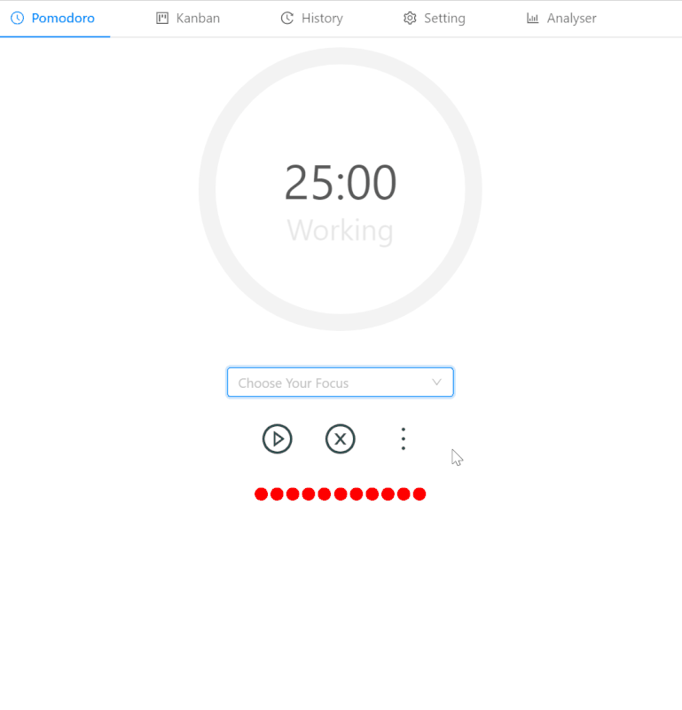      |          |
| **Session Finished**                                         | **Switching Mode**                                      |
| 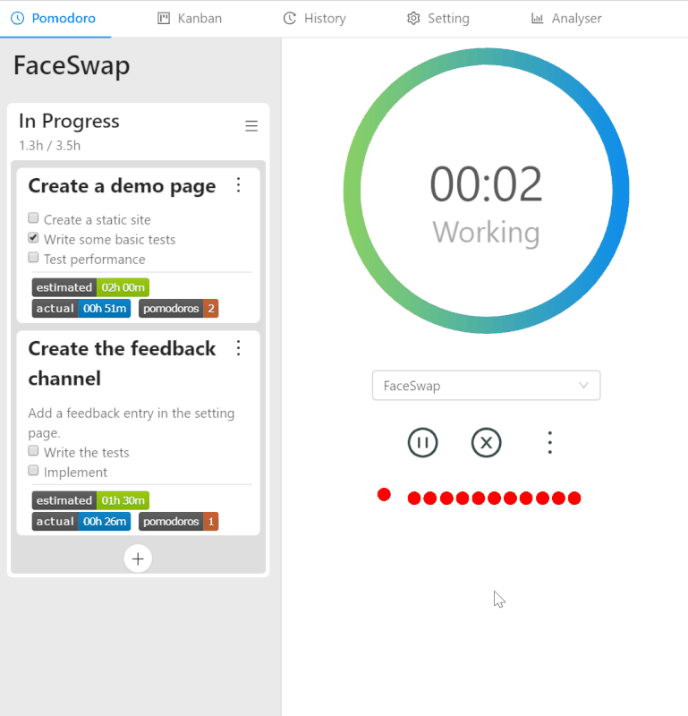 | 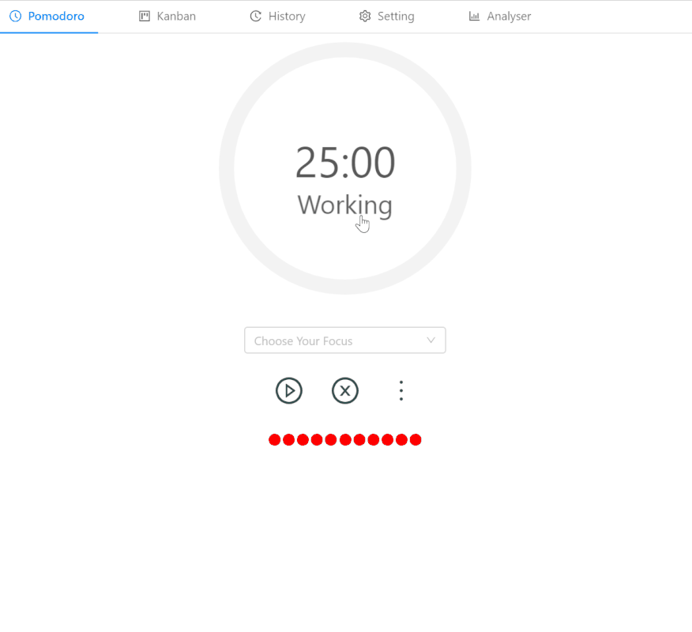 |

## ③ 📝 Record: Desktop Activity Tracking

During focus sessions, the app automatically records the **names and titles** of the apps you are using. Titles carry rich semantics: a browser title reveals the page you are reading, while an IDE title often contains the project name or path.

- `Pomodoro Technique - Wikipedia - Google Chrome`
- `DeepMind (@DeepMindAI) | Twitter - Google Chrome`
- `pomodoro-logger [C:\code\pomodoro-logger] .\src\renderer\components\src\Application.tsx - WebStorm`

Review these records to see where your time went — in the "Visualize" stage, you can see the **pie chart** (time split by project / app) and the **word cloud** (top keywords).

  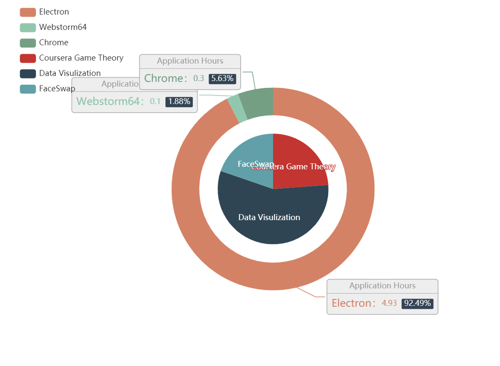
  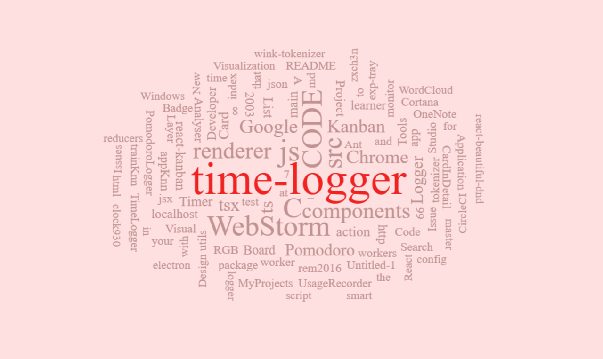

## ④ 🔧 Process: Local Data & Efficiency

- All records are **saved and processed locally** and never uploaded; you can **import / export / delete** everything with one click from the settings.
- Keep a list of "distracting apps" in the settings. Once the app detects that you are using one of them, your efficiency for that session drops, computed by [a heuristic method](./src/shared/efficiency/efficiency.png).
- Once tasks are linked to their focus sessions, you can analyze how often you are interrupted by email / social apps and which apps you actually used to get things done, giving you a more complete picture of your time.

  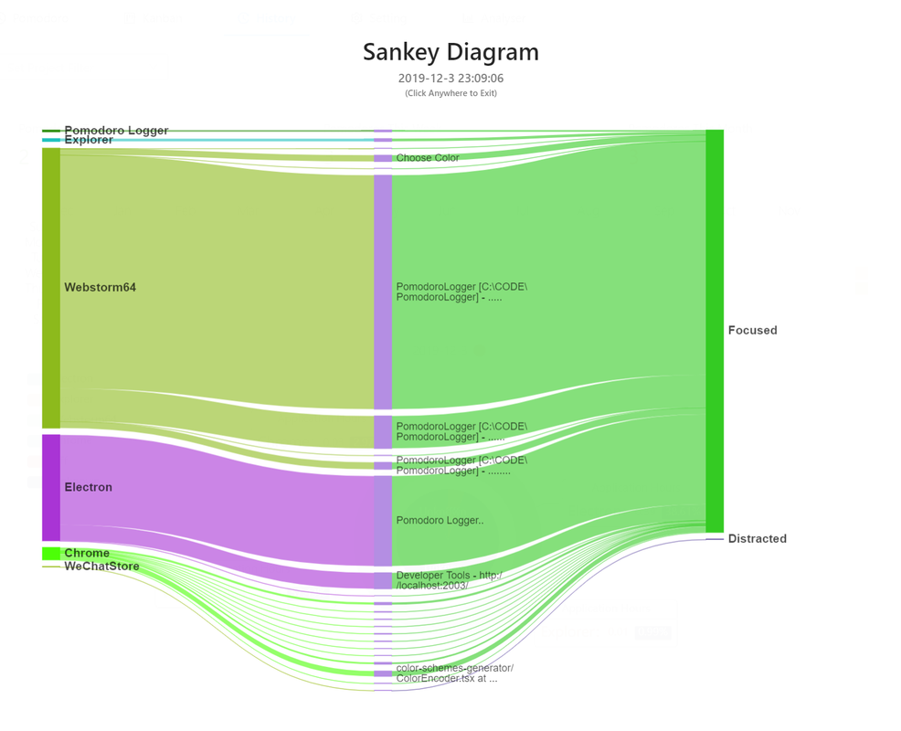

## ⑤ 📊 Visualize: History & Efficiency

The **History view** aggregates all records into a calendar heat map and dives into every single day. Your **efficiency** is shown as dots: **the larger the hole, the less efficient you are**. Click a dot to inspect the detailed records of that period.

  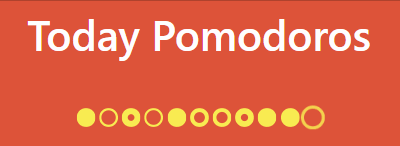

  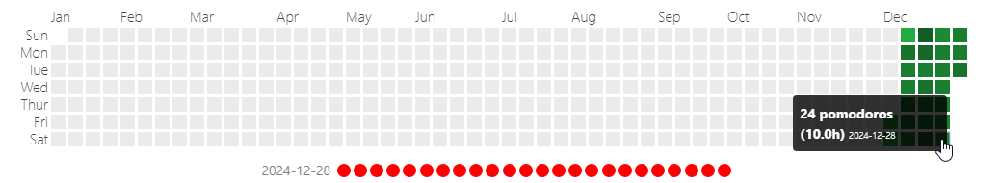

<b>📌 History View Enhancements</b> —— year selector · time spent per project · custom base color

 

- **Year selector**: switch between years (or view all time).
- **Time spent per project**: view the total time and pomodoro count spent on a selected project in a selected year.
- **History review**: click any day on the heat map to see that day's **pie chart** and **word cloud**; switching projects or years also shows the corresponding **pie chart** and **word cloud**.
- **Custom base color**: customize the heat map base color in the settings.

## 🚀 Quick Start

Supports **Windows 10 / macOS / Linux**. Download the installer for your platform from the [release page](https://github.com/NightZed/PomodoroLogger-Enhanced/releases).

## 🤝 Contribution

Welcome! Read [the Contribution Guide](./.github/CONTRIBUTION.md) for details.

- The roadmap is shown on the [issue page](https://github.com/NightZed/PomodoroLogger-Enhanced/issues)
- If you find a bug or want a new feature, [create an issue](https://github.com/NightZed/PomodoroLogger-Enhanced/issues)
- If you want to start working on an issue, read [the Contribution Guide](./.github/CONTRIBUTION.md) and comment on the issue to let me know

## 📄 License

[GPL-3.0 License](./LICENSE)

Copyright © 2019 Zixuan Chen —— the original author.