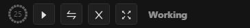
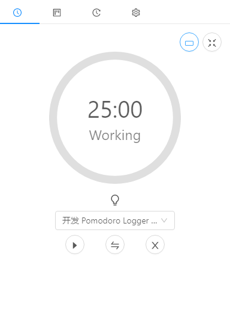
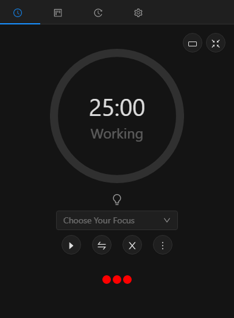
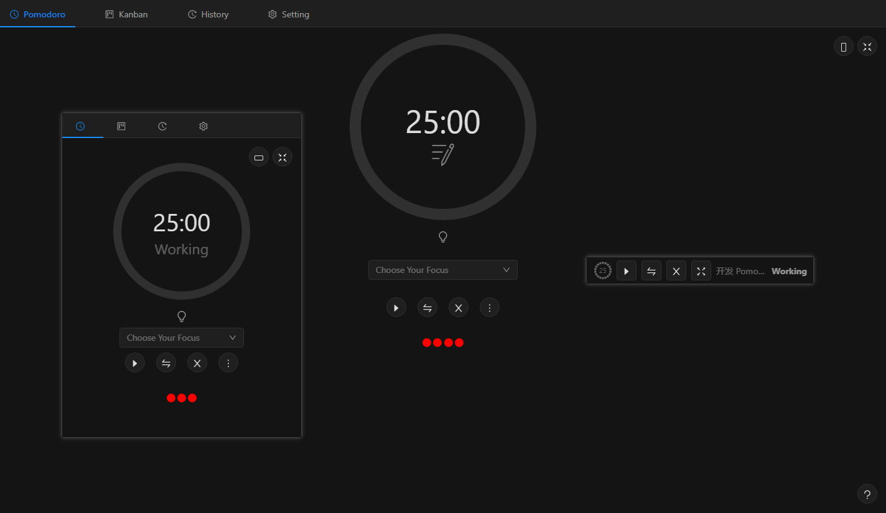

<p align="center">
  
</p>

<p align="center">
    <a href="README_ZH.md">
      
      中文
    </a>
</p>

<p align="center">
  <a href="https://github.com/NightZed/PomodoroLogger-Enhanced/actions/workflows/build.yml">
    
  </a>
  <a href="https://github.com/semantic-release/semantic-release">
    
  </a>
  <a href="https://github.com/NightZed/PomodoroLogger-Enhanced/releases/latest">
    
  </a>
  <a href="https://github.com/NightZed/PomodoroLogger-Enhanced/releases">
    
  </a>
  <a href="https://deepwiki.com/NightZed/PomodoroLogger-Enhanced">
    
  </a>
</p>

# Pomodoro Logger Enhanced 🕢

> **Invest your time easily**

Pomodoro Logger 🕢 —— [Pomodoro Technique](https://en.wikipedia.org/wiki/Pomodoro_Technique) + [Kanban task management](https://en.wikipedia.org/wiki/Kanban_board) + desktop activity tracking + data visualization.

This repository is an enhanced edition of the [original Pomodoro Logger](https://github.com/zxch3n/PomodoroLogger), with a focus on **card editing** and **history view review**, plus optimizations to **memory usage and CPU usage**.

> 🧭 Contents: [Overview](#overview) · [Features](#features) · [Pomodoro](#pomodoro) · [Kanban](#kanban-board) · [Statistics](#statistics) · [Quick Start](#quick-start)

<a id="overview"></a>

## 📖 Overview

<p align="center">
  
  
</p>

> Above: the Kanban board (left) and the History view (right) — from planning tasks to reviewing your time.

<a id="pomodoro"></a>

## ⏱️ Pomodoro

A work cycle = **focus + rest**: 25 minutes of focus and a 5-minute short break by default, plus a longer long break. All three durations can be adjusted in the settings.

### Timer & Mode Switching

|                                  Session Finished                                   |                                         Switching Mode                                         |                                Choosing a Focus Task                                |
| :---------------------------------------------------------------------------------: | :--------------------------------------------------------------------------------------------: | :---------------------------------------------------------------------------------: |
|  |  |  |

### Tray / Mini / Small / Night Mode

-   **Tray**: closing the main window minimizes the app to the system tray.

<p align="center">
  
</p>

-   **Mini mode**: use `F12` to switch between the full interface and mini mode.

<p align="center">
  
  
</p>

-   **Small Mode**：use `F11` to switch between the full interface and small mode.

<p align="center">
  
  

<a id="kanban-board"></a>

-   **Night Mode**：switch between day and night mode.

<p align="center">
  

<a id="kanban-board"></a>

## 🗃️ Kanban

### Boards & Lists

The built-in [Kanban board](https://en.wikipedia.org/wiki/Kanban_board) works together with the Pomodoro timer.

-   **Lists**: `Backlog`, `Todo`, `In Progress`, and `Done`. The names match the interface; you can customize the lists, but please keep `In Progress` and `Done`, otherwise time cannot be tracked, estimated, or analyzed.
-   **Linked to the timer**: while you focus on a board, your focus sessions are automatically linked to the cards in that board's `In Progress` list.
-   **Actions**: drag cards between lists; press `Ctrl+F` to search cards.

> 💡 Tip: the fewer cards in `In Progress`, the more accurate your statistics.

|                                 Dragging Cards                                 |                                Searching Cards                                |
| :----------------------------------------------------------------------------: | :---------------------------------------------------------------------------: |
|  |  |

### 🃏 Cards

-   **Markdown editing**: card content supports Markdown, and the editor offers quick actions for task boxes (`[ ]`), **bold**, _italic_, ~~strikethrough~~, and links.
-   **Colored labels**: colored labels with suggestions and search, plus **click-to-filter**.
-   **Creation / completion time**: boards and cards both show their creation time, and a card shows its completion time once it is dragged into `Done`.
-   **Estimated time**: set an estimate on a card, and the Pomodoro timer accumulates the actual time spent.

|                                        Card Editor & Labels                                         |                            Estimated Time on a Card                             |
| :-------------------------------------------------------------------------------------------------: | :-----------------------------------------------------------------------------: |
|  |  |

<a id="statistics"></a>

## 📊 Statistics

### 📈 Time Spent per Project

Total time and pomodoro count, broken down by **project + year**.

<p align="center">
  
</p>

### 🗓️ Calendar Heat Map

The **History view** aggregates all records into a calendar heat map: the denser the color, the more time you put in that day. You can switch between years or view all time, and click any day to expand its details. The base color of the heat map can be customized in the settings.

<p align="center">
  
</p>

### ⚡ Efficiency Analysis

**Efficiency** is shown as dots: **the larger the hole in a dot, the lower your efficiency**. Click a dot to open the distraction Sankey diagram of that session. How efficiency is computed: see [Efficiency & Distractions](#efficiency-distraction).

<p align="center">
  
</p>

The **Sankey diagram** connects distracting apps with where your time went.

<p align="center">
  
</p>

### 🥧 Time Proportion Pie Chart · Word Cloud

The **pie chart** shows the share of time per project / app, and the **word cloud** shows the keywords that appear most often in window titles. Click a day on the heat map, or switch the project and year, and the charts update accordingly.

<p align="center">
  
  
</p>

<a id="features"></a>

## ✨ Features

### 🖥️ Desktop Activity Tracking

-   **Apps & titles**: during focus sessions the app records the names and window titles of what you are using. A browser title reveals the page you are reading, while an IDE title contains the project name or file path.
-   **Scheduled screenshots** (optional): turn on `Screenshot` in the settings, and the app also keeps periodic screen captures during focus sessions for later review.

```text
Pomodoro Technique - Wikipedia - Google Chrome
DeepMind (@DeepMindAI) | Twitter - Google Chrome
pomodoro-logger [C:\code\pomodoro-logger] .\src\renderer\components\src\Application.tsx - WebStorm
```

These raw records are aggregated into the time proportion pie chart and word cloud in [Statistics](#statistics).

<a id="data-privacy"></a>

### 🔒 Data & Privacy

-   **Local storage**: all data is saved on your own machine.
-   **Export / import / delete**: back up, migrate, or clear everything with one click in the settings.
-   **Data directory**: `db/` holds the databases, `screenshots/` holds the periodic screenshots.

| Platform | Data directory                          |
| :------- | :-------------------------------------- |
| Windows  | `%APPDATA%\PomodoroLogger\`             |
| macOS    | `~/Library/Preferences/PomodoroLogger/` |
| Linux    | `~/.local/share/PomodoroLogger/`        |

<a id="efficiency-distraction"></a>

### 🎯 Efficiency & Distractions

-   **Distracting apps**: keep a list of "distracting apps" in the settings; whenever the app detects you using one of them, the efficiency of that session drops.
-   **Efficiency score**: computed by [a heuristic method](./src/shared/efficiency/efficiency.png) and shown as dots, see [Statistics](#statistics).
-   **Insights after linking**: once tasks are linked to their focus sessions, you can analyze how often you are interrupted by email / social apps, and which apps you actually used to get a task done.

### 🧩 System & Settings

-   **Durations**: focus / short break / long break durations are all adjustable in the settings.
-   **System tray**: the remaining time stays visible in the tray after minimizing, see [Pomodoro](#pomodoro).
-   **Start on boot · Auto update · Hardware acceleration**: toggle them in the settings; hardware acceleration changes need a restart to apply.
-   **Built-in guide**: the app walks you through the basics with step-by-step hints.

### ⌨️ Shortcuts

-   **Switch pages**: `Ctrl+Tab` / `Ctrl+Shift+Tab`.
-   **Search cards**: `Ctrl+F` (Kanban page).
-   **Quick Save**：`Ctrl+Enter`(Card edit).
-   **Quit**: `Ctrl+Q`.
-   **Mini mode**: `F12`.
-   **Small mode**：`F11`.

<a id="quick-start"></a>

## 🚀 Quick Start

Platforms: **Windows 10 / macOS 12+ / Linux**.
Download: [release page](https://github.com/NightZed/PomodoroLogger-Enhanced/releases).

## 🤝 CONTRIBUTING

Welcome! The development setup, coding conventions, and release process are all documented in [the CONTRIBUTING Guide](./.github/CONTRIBUTING.md).

-   The roadmap is shown on the [issue page](https://github.com/NightZed/PomodoroLogger-Enhanced/issues)
-   If you find a bug or want a new feature, [create an issue](https://github.com/NightZed/PomodoroLogger-Enhanced/issues)
-   If you want to start working on an issue, read [the CONTRIBUTING Guide](./.github/CONTRIBUTING.md) and comment on the issue to let me know

## 📄 License

[GPL-3.0 License](./LICENSE)

Copyright © 2019 Zixuan Chen —— the original author.

This repository is a GPL-3.0 modified version of Pomodoro Logger, released under GPL-3.0 as well.
