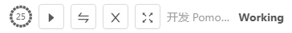

<p align="center">
  
</p>

<p align="center">
    <a href="README.md">
      
      English
    </a>
</p>

<p align="center">
  <a href="https://github.com/NightZed/PomodoroLogger-Enhanced/actions/workflows/build.yml">
    
  </a>
  <a href="https://github.com/semantic-release/semantic-release">
    
  </a>
  <a href="https://github.com/NightZed/PomodoroLogger-Enhanced/releases/latest">
    
  </a>
  <a href="https://github.com/NightZed/PomodoroLogger-Enhanced/releases">
    
  </a>
  <a href="https://deepwiki.com/NightZed/PomodoroLogger-Enhanced">
    
  </a>
</p>

# 番茄日志 Pomodoro Logger Enhanced 🕢

> **轻松投资你的时间**

番茄日志🕢——[番茄钟工作法](https://zh.wikipedia.org/wiki/番茄工作法) + [看板任务管理](https://en.wikipedia.org/wiki/Kanban_board) + 桌面活动追踪 + 数据可视化分析。

本仓库是[原版 Pomodoro Logger](https://github.com/zxch3n/PomodoroLogger) 的增强版，主要加强了**卡片编辑**与**历史视图回顾**，并优化了**内存占用与 CPU 占用**。

> 🧭 导读：[概览](#overview) · [功能特性](#features) · [番茄钟](#pomodoro) · [看板](#kanban-board) · [统计与分析](#statistics) · [快速开始](#quick-start)

<a id="overview"></a>

## 📖 概览 Overview

<p align="center">
  
  
</p>

> 上图：看板（左）与历史视图（右）——从规划任务到回看时间。

<a id="pomodoro"></a>

## ⏱️ 番茄钟 Pomodoro

一个工作循环 = **专注 + 休息**：默认 25 分钟专注、5 分钟短休，长休更长一些，三者时长都可以在设置页调整。

### 计时与模式切换

|                                  时段结束提醒                                   |                                     切换模式                                     |                                选择专注对象                                |
| :-----------------------------------------------------------------------------: | :------------------------------------------------------------------------------: | :------------------------------------------------------------------------: |
|  |  |  |

### 托盘与迷你模式

- **托盘**：关闭主页面缩放到系统托盘

<p align="center">
  
</p>

- **迷你模式**：用 `F11` / `F12` 在完整界面与迷你模式之间切换。

<p align="center">
  
</p>

<a id="kanban-board"></a>

## 🗃️ 看板 Kanban

### 看板与列

内置[看板](https://en.wikipedia.org/wiki/Kanban_board)，并与番茄钟联动。

- **列结构**：`Backlog`（待办）、`Todo`（今日待办）、`In Progress`（进行中）、`Done`（已完成）。列名与界面一致；你可以自定义列表，但请保留 `In Progress` 与 `Done`，否则时间无法跟踪、估算与分析。
- **与番茄钟联动**：在某个看板专注时，番茄时段会自动关联到该看板 `In Progress` 列表中的卡片。
- **操作**：拖拽卡片在列之间移动；`Ctrl+F` 搜索卡片。

> 💡 提示：`In Progress` 中的卡片越少，统计越准确。

|                                 拖拽卡片                                 |                                搜索卡片                                |
| :----------------------------------------------------------------------: | :--------------------------------------------------------------------: |
|  |  |

### 🃏 卡片

- **Markdown 编辑**：卡片内容支持 Markdown，编辑器提供任务框（`[ ]`）、**加粗**、_斜体_、~~删除线~~、链接等快捷操作。
- **彩色标签**：支持颜色标签、标签建议与搜索，支持**点击标签过滤**。
- **创建 / 完成时间**：看板与卡片都会显示创建时间，卡片拖入 `Done` 后会显示完成时间。
- **预估耗时**：卡片上可以填写预估耗时，实际投入由番茄钟自动累计。

|                                     卡片编辑器与标签                                      |                              卡片预估耗时                               |
| :---------------------------------------------------------------------------------------: | :---------------------------------------------------------------------: |
|  |  |

<a id="statistics"></a>

## 📊 统计与分析 Statistics

### 📈 项目消耗时间

按**项目 + 年份**统计总耗时与完成的番茄钟数量。

<p align="center">
  

### 🗓️ 日历热力图

**历史视图**把所有记录汇总到一张日历热力图上，颜色深浅代表当天投入的多少；可以切换年份或查看全部时间，点开任意一天即可展开当天详情。热力图的基色可以在设置页自定义。

<p align="center">
  
</p>

### ⚡ 效率分析

**效率**以圆点呈现：**圆点中的空洞越大，效率越低**；点击圆点即可查看该时段的分心应用桑基图。效率计算见[效率与分心](#efficiency-distraction)。

<p align="center">
  
</p>

**桑基图**把分心应用与时间去向连成一张流向图。

<p align="center">
  
</p>

### 🥧 时间占比饼图 · 词云

**饼图**看各项目 / 应用的时间占比，**词云**看窗口标题里出现最多的关键词。点开热力图中的某一天，或切换项目与年份，图表都会跟着更新。

<p align="center">
  
  
</p>

<a id="features"></a>

## ✨ 功能特性 Features

### 🖥️ 桌面活动记录

- **应用与标题**：专注期间自动记录当前使用的应用名称与窗口标题；浏览器标题对应当前网页，IDE 标题里则包含项目名或文件路径。
- **定时截图**（可选）：在设置页打开 `Screenshot` 后，专注期间会按间隔把屏幕截图一并留档，方便事后核对。

```text
Pomodoro Technique - Wikipedia - Google Chrome
DeepMind (@DeepMindAI) | Twitter - Google Chrome
pomodoro-logger [C:\code\pomodoro-logger] .\src\renderer\components\src\Application.tsx - WebStorm
```

这些原始记录会在[统计与分析](#statistics)里汇总成时间占比饼图与词云。

<a id="data-privacy"></a>

### 🔒 数据与隐私

- **本地存储**：所有数据保存在本地。
- **导出 / 导入 / 删除**：在设置页一键备份、迁移或清空全部数据。
- **数据目录**：`db/` 存数据库，`screenshots/` 存定时截图。

| 平台    | 数据目录                                |
| :------ | :-------------------------------------- |
| Windows | `%APPDATA%\PomodoroLogger\`             |
| macOS   | `~/Library/Preferences/PomodoroLogger/` |
| Linux   | `~/.local/share/PomodoroLogger/`        |

<a id="efficiency-distraction"></a>

### 🎯 效率与分心

- **分心应用**：在设置页维护一份“分心应用”列表，一旦检测到你在使用其中的应用，该时段的效率就会降低。
- **效率计算**：效率由[一种启发式方法](./src/shared/efficiency/efficiency.png)算出，并以圆点呈现，见[统计与分析](#statistics)。
- **关联之后的洞察**：把任务与专注时段关联起来，就能分析“被邮件 / 社交软件打断的频率”，以及“完成某个任务究竟用到了哪些应用”。

### 🧩 系统与设置

- **时长设置**：专注 / 短休 / 长休的时长都可以在设置页调整。
- **系统托盘**：窗口最小化后仍在托盘显示剩余时间，见[番茄钟](#pomodoro)。
- **开机启动 · 自动更新 · 硬件加速**：在设置页一键开关，硬件加速改动后需重启生效。
- **内置引导**：应用内提供分步上手引导。

### ⌨️ 快捷键

- **页面切换**：`Ctrl+Tab` / `Ctrl+Shift+Tab`。
- **搜索卡片**：`Ctrl+F`（Kanban 页）。
- **快速保存**：`Ctrl+Enter`（Card 编辑）。
- **退出应用**：`Ctrl+Q`。
- **迷你模式**：`F11` / `F12`。

<a id="quick-start"></a>

## 🚀 快速开始

平台支持： **Windows 10 / macOS / Linux**，
下载：[发布页面](https://github.com/NightZed/PomodoroLogger-Enhanced/releases)。

## 🤝 参与贡献

欢迎你的参与！开发环境搭建、代码规范与发版流程都写在[贡献指南](./.github/CONTRIBUTION.md)里。

- 路线图见 [issue 页面](https://github.com/NightZed/PomodoroLogger-Enhanced/issues)
- 发现 bug 或想提新功能，请[创建 issue](https://github.com/NightZed/PomodoroLogger-Enhanced/issues)
- 想动手处理某个 issue，阅读[贡献指南](./.github/CONTRIBUTION.md)并在 issue 下留言即可

## 📄 许可证

[GPL-3.0 License](./LICENSE)

Copyright © 2019 Zixuan Chen —— 原版作者。

本仓库是 Pomodoro Logger 的 GPL-3.0 修改版，同样以 GPL-3.0 授权发布。
